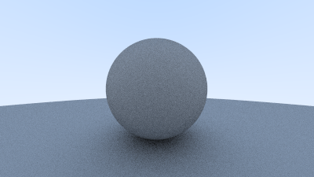

# raytracer-rust

A ray tracer in Rust based on [Peter Shirley](https://www.petershirley.com)'s awesome 
[Ray Tracing in One Weekend](https://raytracing.github.io/books/RayTracingInOneWeekend.html) (v3.2.3).


## Requirements

- [Rust](https://www.rust-lang.org) 1.68

## Building and running

Run:

```
cargo run --release > image.ppm
```

to build and generate the image. Use macOS' built-in Preview app to view the [PPM](https://en.wikipedia.org/wiki/Netpbm#PPM_example) image or any other image viewer that supports PPM.

## Reproducing intermediate images in the book

The images below can be reproduced by checking out specific Git tags:

<table>
  <tr>
    <td><p align="center"><br>rtiow-image1</p></td>
    <td><p align="center"><br>rtiow-image2</p></td>
    <td><p align="center"><br>rtiow-image3</p></td>
    <td><p align="center"><br>rtiow-image4</p></td>
  </tr>
  <tr>
    <td><p align="center"><br>rtiow-image5</p></td>
    <td><p align="center"><br>rtiow-image6</p></td>
    <td><p align="center"><br>rtiow-image7</p></td>
    <td><p align="center"><br>rtiow-image8</p></td>
  </tr>
  <tr>
    <td><p align="center"><br>rtiow-image9</p></td>
    <td><p align="center"><br>rtiow-image10</p></td>
    <td><p align="center"><br>rtiow-image11</p></td>
    <td><p align="center"><br>rtiow-image12</p></td>
  </tr>
  <tr>
    <td><p align="center"><br>rtiow-image14</p></td>
    <td><p align="center"><br>rtiow-image15</p></td>
    <td><p align="center"><br>rtiow-image16</p></td>
    <td><p align="center"><br>rtiow-image17</p></td>
  </tr>
  <tr>
    <td><p align="center"><br>rtiow-image18</p></td>
    <td><p align="center"><br>rtiow-image19</p></td>
    <td><p align="center"><br>rtiow-image20</p></td>
    <td><p align="center"><br>rtiow-image21</p></td>
  </tr>
</table>

For example:

```
git checkout rtiow-image10
cargo run --release > image10.ppm
```
